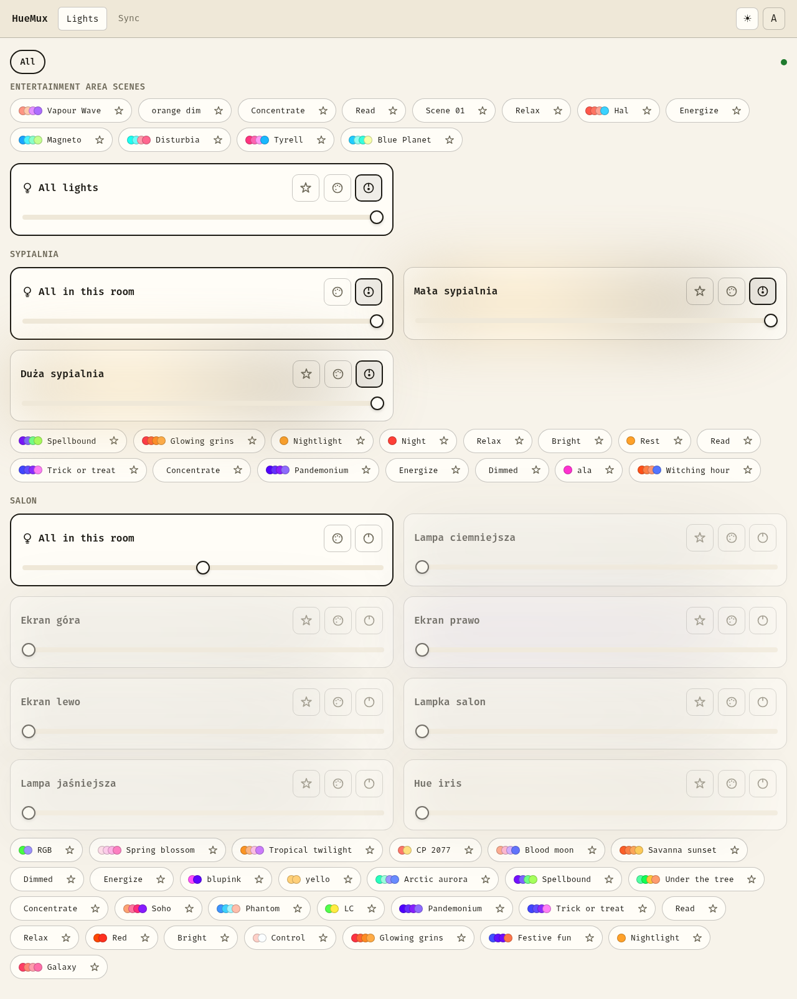
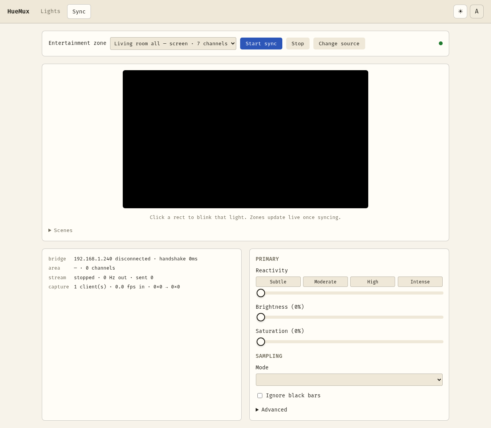

# HueMux

Lightweight, cross-platform frontend for Philips Hue: a Go server you drive
from a browser or an Electron desktop app. Two things in one binary —

- **Screen sync** — captures your screen and streams it to a Hue
  Entertainment area over DTLS, in real time.
- **Light control** — day-to-day control of every room, light, and scene on
  the bridge: on/off, brightness, colour, favorites.

Both talk to the bridge directly; no cloud, no Hue Sync app, no
platform-specific screen-capture hacks. Video sync works natively on
Wayland, X11, Windows, and macOS.

```
browser (127.0.0.1) ──grid──▶ huemux ──DTLS/UDP──▶ Hue bridge ──Zigbee──▶ lights
```

## Screenshots

Both pages follow the system theme by default (or a manual light/dark
override via the header toggle) — shown here in both.

<p align="center">
  <picture>
    <source media="(prefers-color-scheme: dark)" srcset="docs/screenshots/huemux-lights-dark.png">
    
  </picture>
  <br><sub>Light control</sub>
</p>

<p align="center">
  <picture>
    <source media="(prefers-color-scheme: dark)" srcset="docs/screenshots/huemux-sync-dark.png">
    
  </picture>
  <br><sub>Screen sync</sub>
</p>

## Why it runs on localhost

`getDisplayMedia()` — the browser screen capture API — only works in a
secure context, and loopback origins are one without needing a certificate.
The same process also owns the DTLS socket to the bridge, which a browser
can never open itself: Hue Entertainment is DTLS 1.2 with a pre-shared key
over UDP, and no browser API exposes that. One binary solves both problems.

## Releases and stability

Pre-1.0 and young. Two release streams on the
[releases page](https://github.com/zamber/huemux/releases):

- **Stable** (`v0.0.1`, …) — what has actually been used against real
  hardware. Start here.
- **Alpha** (`v0.0.2-alpha.1`, …) — tagged from `main` as work lands, built
  and tested in CI but **not exercised on real hardware**. Marked as
  pre-releases on GitHub. Fine for following along or testing a fix; not what
  to hand someone who just wants working lights.

Work in progress, and the design docs behind it, live in
[`plans/`](plans/) — see
[`plans/03-execution-phases.md`](plans/03-execution-phases.md) for what is
actually being built right now.

## Configuration

Optional. With no configuration at all, HueMux runs exactly as it always has:
both features, bound to `127.0.0.1`, no authentication.

Settings are read from `~/.config/huemux/app.json` (`%APPDATA%\huemux\` on
Windows, `~/Library/Application Support/huemux/` on macOS) and can be
overridden per-run by the flags in the
[command-line reference](#command-line-reference) below. Precedence is
defaults, then the file, then any flag you actually pass. A missing file is
normal — nothing creates one for you.

```jsonc
{
  "profile": "full",                 // full | lights | sync
  "listen":  { "host": "127.0.0.1", "port": 7654 },
  "auth":    { "mode": "none" },     // none | token
  "tls":     { "mode": "off" }       // off | selfsigned | files
}
```

Or edit them in the browser at `/settings.html`. Changes are only accepted
from the machine HueMux runs on — rewriting the listen address or turning
authentication off should not be reachable from the network it governs.

### Exposing HueMux beyond this machine

`listen.host` defaults to `127.0.0.1`, which is what makes the whole thing
safe without a password: nothing else can reach it. Changing that is the one
setting with real consequences, so it comes with two others.

```jsonc
{
  "profile": "lights",
  "listen": { "host": "0.0.0.0", "port": 7654 },
  "auth":   { "mode": "token", "token": "otter.beacon.willow" },
  "tls":    { "mode": "selfsigned" }
}
```

- **`auth.mode: "token"`** requires a token on every API call and WebSocket
  upgrade, as `Authorization: Bearer <token>` or `?token=<token>` (a browser's
  WebSocket cannot set headers, hence the query form). Connections from the
  machine itself are exempt, so nothing about local use changes and you can
  never lock yourself out. Failed attempts are rate limited — the token is
  short and memorable by design, which is only defensible with a limiter in
  front of it. Generate one from the settings page, or let HueMux print one on
  first non-loopback start.
- **`tls.mode`** — `selfsigned` generates and reuses a certificate (browsers
  will warn; it covers both loopback and your LAN address). `files` uses a
  real certificate you already have. HueMux obtains nothing itself, which
  means every sane option works: `tailscale cert`, a DNS-01 certificate for a
  domain you own, or a local CA like mkcert. **Tailscale is the least
  painful** — auto-renewing, no port forwarding, and it works off your LAN too.

A token over plain HTTP crosses the network in cleartext, and HueMux says so
at startup rather than letting you find out later.

## Running

### Browser version

```bash
./huemux
```

Opens `http://127.0.0.1:7654` (prints the exact URL too — some other port if
7654 is taken). If you haven't paired yet, it walks you through that first:
searches for a bridge automatically (falling back to a manual IP field —
useful if your Hue gear is on a separate VLAN), then asks you to press the
bridge's link button. No terminal required for any of it.

Pairing, listing areas, and a DTLS smoke test are also available from the
command line, for scripting or diagnosing a stream that isn't reaching the
bridge:

```bash
./huemux pair 192.168.1.42                        # press the link button when prompted
./huemux areas                                     # list entertainment areas
./huemux test <entertainment-configuration-id>     # prove the DTLS path works before touching any video
```

For screen sync, you need at least one entertainment area, created in the
Hue app under **Settings → Entertainment areas**. Where you place each light
in that layout decides which part of the screen it samples.

### Desktop (Electron) version

Same core, wrapped in a real desktop window — real screen capture with no
picker dialog on X11/Windows/macOS (Wayland needs a one-time OS consent
dialog; see below), and a native app icon/window instead of a browser tab.

```bash
./huemux-desktop             # opens a window
./huemux-desktop --headless  # identical to plain huemux — no Electron, no GUI dependency paid at runtime
```

First non-headless launch downloads Electron (~150MB) into your OS cache
directory — needs internet access once, cached after that.

**Wayland users:** screen capture needs PipeWire + `xdg-desktop-portal`
installed and running (already the case on virtually every modern Wayland
desktop). The first time you start sync you'll see your compositor's own
screen-share consent dialog — that's Wayland's security model, not
something this app can bypass, unlike X11.

### macOS

macOS will ask for **Screen Recording** permission the first time either
version tries to capture your screen (System Settings → Privacy & Security
→ Screen Recording) — grant it to your terminal (browser version) or to
HueMux.app (desktop version), then retry.

## Command-line reference

### `huemux`

| Command / flag | What it does |
|---|---|
| `huemux` | Default mode: serves the UI at `http://127.0.0.1:7654` (or the next free port if that one's taken — the exact URL is always printed), opens it in your default browser, and runs the output loop. If you haven't paired yet, it serves a web-based pairing flow over the same connection instead of failing — no subcommand required. |
| `huemux -v` / `huemux --verbose` | Same as the default mode, but the CLI status readout prints one flat, timestamp-free line per tick instead of repainting a live block in place with cursor-movement escapes. Use this when redirecting to a file or running under a service manager/systemd unit that doesn't handle those escapes. |
| `huemux pair <bridge-ip>` | Register with a Hue bridge from the command line, for scripting or a headless box with no browser. Press the bridge's physical link button when prompted — you have 60s. Fails if the bridge is too old to support Entertainment areas (needs a square/v2 bridge). |
| `huemux pair` (no IP) | Same, but auto-discovers candidate bridges on the local network first and lists their IPs rather than pairing immediately — run `huemux pair <ip>` again with one of them. |
| `huemux areas` | Lists entertainment areas configured on the already-paired bridge: ID, name, configuration type, channel count, and `[in use]` if something (possibly another app) is already streaming to it. Requires pairing first. |
| `huemux test <area-id>` | Proves the DTLS path to one entertainment area works, independent of any browser or capture: turns on every light behind that area's channels, cycles red/green/blue/white for 2s each, then holds for 60s sending only keepalive frames (no color commands) so you can confirm the bridge doesn't silently revert without constant traffic, then fades out cleanly. Use this to isolate "is the DTLS session itself broken" from "is screen capture broken." |
| `huemux -debug` (combine with anything, e.g. `huemux -debug -v` or `huemux -debug pair 192.168.1.42`) | Writes a full debug log to a timestamped file — not just app-level log lines, but everything the process would otherwise print to its terminal, plus an unrecovered panic if one happens. See [Known issues](#known-issues) below for the exact path per OS and what to attach when reporting a bug. |
| `huemux -h` / `huemux --help` | Prints the usage summary. |
| `huemux version` / `huemux --version` | Prints the build version, baked in at release time by the Makefile from `git describe --tags` — matches the git tag a release binary was built from. |

### `huemux-desktop`

Every `huemux` flag/subcommand above works identically here — `--headless`
(below) makes it *be* `huemux` for all practical purposes. Three flags are
desktop-specific:

| Flag | What it does |
|---|---|
| `huemux-desktop` | Opens a real desktop window (Electron) around the same core server as the browser version: real screen capture with no `getDisplayMedia()` picker dialog on X11/Windows/macOS, and a native app icon/window instead of a browser tab. First non-headless launch downloads Electron (~150MB) into your OS cache directory — needs internet access once, cached after that. |
| `huemux-desktop --headless` | Skips the Electron window entirely and runs byte-for-byte the same loop as plain `huemux`, including its subcommands. For a headless server where you don't want to pay Electron's download size or GUI dependency for a build you'll never actually put a window on screen. |
| `huemux-desktop --verbose` | Same flat-line-vs-repaint distinction as `huemux -v`. Only has a visible effect combined with `--headless` — the non-headless desktop window has its own UI, no CLI status block to render. |

### Environment variables

These are diagnostic escape hatches, not everyday configuration — most
people never need any of them:

| Variable | Applies to | Effect |
|---|---|---|
| `XDG_STATE_HOME` | both binaries, Linux/BSD only | Overrides where the `-debug` log directory lives (default `~/.local/state/huemux`). Standard XDG Base Directory variable, not HueMux-specific. |
| `HUEMUX_DEVTOOLS=1` | `huemux-desktop`, non-headless | Opens Chrome DevTools on the app window at launch — for inspecting the page itself, separate from the `-debug` log's main-process output. |
| `HUEMUX_OZONE_PLATFORM=x11` | `huemux-desktop`, Wayland sessions | Forces Chromium's ozone platform, routing screen capture through XWayland instead of native Wayland/PipeWire. A diagnostic for the green-preview bug in [Known issues](#known-issues) below — try it if you hit that symptom, since it isolates whether the bug is in Wayland's native capture path specifically. |
| `HUEMUX_DISABLE_VULKAN=1` | `huemux-desktop`, Wayland sessions | Forces Chromium's ANGLE GL backend instead of Vulkan, while staying on native Wayland. The other diagnostic for the same bug — see Known issues for what each combination tells you. |

## Controls

| Control | What it does |
|---|---|
| Reactivity | Length of the averaging window. Subtle → slow wash, Intense → snaps with the content |
| Brightness | Output scale, 0–200 % |
| Saturation | A room-scale average drifts toward white; above 100 % pulls it back |
| Black cutoff | Below this, lights go fully off instead of flickering at the bottom of their range |
| Mode | `edges` / `quadrant` / `global` / `spread` — see ROADMAP |
| Edge width | How far in from the screen edge the sampled bands sit |
| Ignore black bars | Letterbox detection, so bars do not drag every zone toward black |

### Zone mapping

Which physical axis from the Hue app's room layout (x/y/z) becomes
screen-horizontal, screen-vertical, and "depth" is configurable per area,
each independently invertible. Areas don't agree on which axis carries
useful information — a pair of Play bars either side of a monitor plus a
strip above it has meaningful x (left/right) and z (height) but a y (room
depth) that barely varies, since everything's mounted right at the screen,
which is why the defaults are horizontal=x, vertical=z, depth=y rather than
an x/y-only mapping. The invert checkboxes under Sampling → Zone mapping are
the fix if zones come out upside down or mirrored. Depth doesn't position a
zone at all — it scales how large an area it samples (**Depth size
effect**), on the idea that a light physically further from the screen
suits a bigger, more averaged region better than a precise accent.

Settings are stored per entertainment area, so each room keeps its own tuning.

## Light control

Every room and light on the bridge, grouped by room, each with a
per-room bulk tile (toggle/brightness/colour for the whole room via the
bridge's own grouped-light resource) alongside the individual light cards.
Scenes show real colour-swatch previews and a dynamic-scene indicator, and
are grouped the same way — a room's own scenes sit right under that room's
lights; scenes tied to an entertainment zone rather than a room (most
commonly the same zone screen sync uses) get their own separate section.
Favorites (lights, rooms, scenes, or "all lights" as one unit) get quick
one-tap access without the star buttons that could accidentally undo them
sitting in the way.

Screen sync and light control run over the same connection and can run at
the same time — starting sync in one window/tab doesn't block controlling
lights from another, and vice versa; starting sync a second time explicitly
takes over from wherever it was already running, rather than silently
fighting over who's actually driving the stream.

## Building

```bash
make dev            # local binary: huemux
make dev-desktop     # local binary: huemux-desktop
make dist            # static linux/windows/macOS binaries, both architectures, into dist/
make dist-desktop    # same, for the desktop wrapper
```

One external dependency for the core: `pion/dtls`. The desktop wrapper adds
`go-astilectron`. The WebSocket server, colour pipeline, and UI are all
stdlib and plain JavaScript — no bundler, no transpiler, no `package.json`.

**But there is still a build step for frontend changes.** `web/` is compiled
into the binary with `go:embed` (see `assets.go`), so the running server keeps
serving whatever HTML/CSS/JS existed when it was *built*. Editing a file under
`web/` and reloading the browser changes nothing — which reads exactly like
"my fix didn't work" rather than "you're testing an old binary".

Rebuild and restart after every frontend edit:

```bash
make dev && ./huemux
```

To confirm you are actually testing what you just wrote, ask the server rather
than the filesystem:

```bash
curl -s localhost:7654/shared/pairing.js | grep somethingYouJustAdded
```

See [AGENTS.md](AGENTS.md) for the full development and verification workflow,
and [PACKAGING.md](PACKAGING.md) for release signing, semver, and
Homebrew/Flatpak/AppImage packaging.

## Layout

```
cmd/huemux/             entry point, subcommands, output loop
cmd/huemux-desktop/     optional Electron shell around the same core
internal/hue/           CLIP v2 REST client, DTLS session, HueStream encoder
internal/pipeline/      zone mapping, colour, temporal smoothing
internal/lightctl/      day-to-day light control: rooms/lights/scenes, favorites
internal/server/        loopback HTTP server, minimal WebSocket
internal/config/        credentials, per-area settings, favorites
internal/ui/            CLI status readout
web/                    plain HTML/CSS/JS, embedded into the binary
web/shared/             theme tokens, i18n, header — shared by every page
web/sync.html           screen-sync UI
web/lights.html         light-control panel
web/app.html            shell that hosts both pages, each in its own iframe,
                        so switching between them doesn't interrupt either
```

## Known issues

See [KNOWN_ISSUES.md](KNOWN_ISSUES.md) — currently one open item (a
Wayland/Electron-specific green preview on first sync), including how to
capture a `-debug` log if you hit it.

## Security

The server binds `127.0.0.1` only and checks the `Origin` header on
WebSocket upgrades. Do not change either: there is no authentication, and a
socket that drives your lights should not be reachable from the rest of the
network.

## Licence

Code: MIT.

The bundled UI font, [Fira Code](https://github.com/tonsky/FiraCode)
(`web/shared/fonts/`), is under a separate license — the
[SIL Open Font License 1.1](web/shared/fonts/LICENSE-OFL.txt), not MIT. The
OFL permits embedding/bundling the font with software under any license
(including MIT) at no cost; it only restricts selling the font *by itself*
and requires renamed derivatives. Bundling it here doesn't relicense it —
the font files remain OFL, the app's own code remains MIT.
