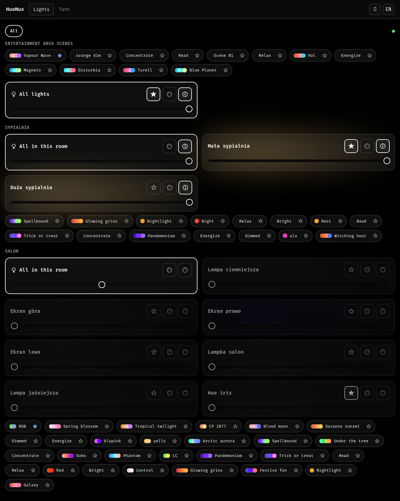
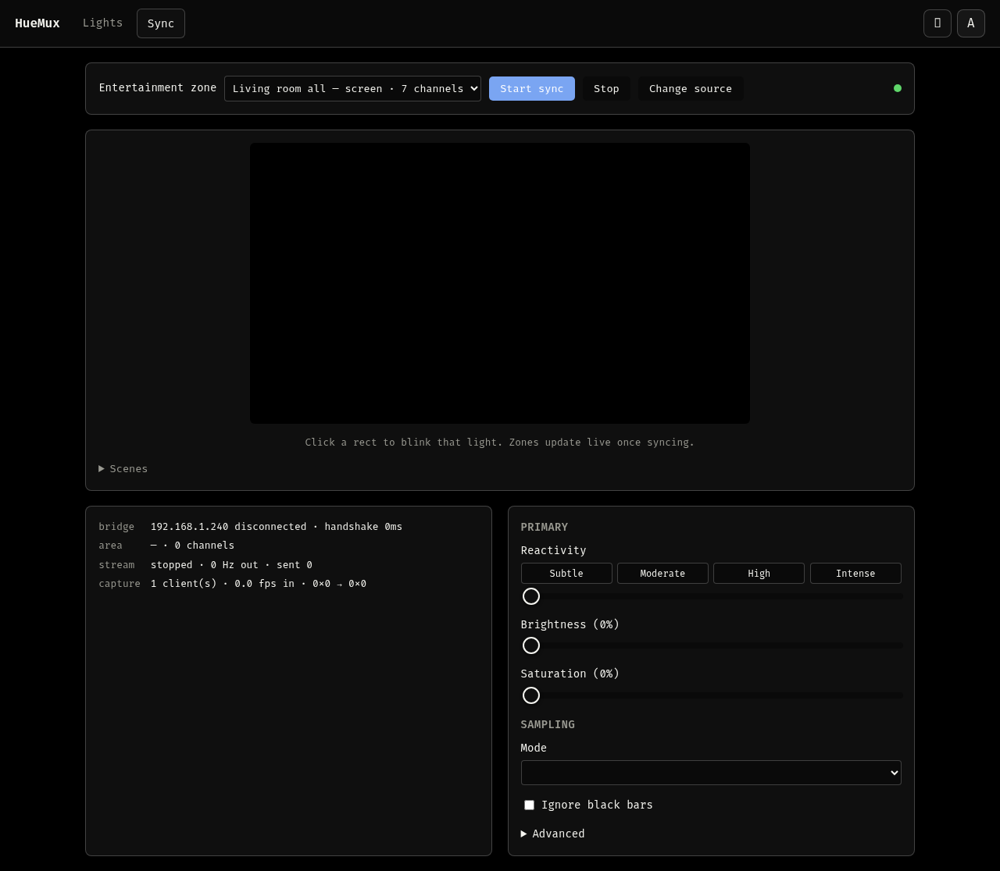

# HueMux

<p class="tagline">Lightweight, cross-platform frontend for Philips Hue: a Go
server you drive from a browser or an Electron desktop app.</p>

<ul class="feature-list">
  <li><strong>Screen sync</strong> — captures your screen and streams it to a Hue Entertainment area over DTLS, in real time.</li>
  <li><strong>Light control</strong> — day-to-day control of every room, light, and scene: on/off, brightness, colour, favorites.</li>
</ul>

Both talk to the bridge directly — no cloud, no Hue Sync app, no
platform-specific screen-capture hacks. Video sync works natively on
Wayland, X11, Windows, and macOS.

<p class="pill-links">
  <a href="https://github.com/zamber/huemux">View source on GitHub</a>
  <a href="https://github.com/zamber/huemux#readme">Read the docs</a>
</p>

## Screenshots

HueMux itself follows the system theme (or a manual override) — click any
screenshot below to zoom in.

<div class="shot-group">
  <h3>Light control</h3>
  <div class="shot-pair">
    <figure class="shot">
      
      <figcaption>Light theme</figcaption>
    </figure>
    <figure class="shot">
      
      <figcaption>Dark theme</figcaption>
    </figure>
  </div>
</div>

<div class="shot-group">
  <h3>Screen sync</h3>
  <div class="shot-pair">
    <figure class="shot">
      
      <figcaption>Light theme</figcaption>
    </figure>
    <figure class="shot">
      
      <figcaption>Dark theme</figcaption>
    </figure>
  </div>
</div>

## Downloads

<div id="releases">Loading releases…</div>

<script>
// Tiny Markdown -> HTML converter for release bodies. Not a general GFM
// implementation — just enough for what these release notes actually use
// (##/### headers, **bold**, *italic*, `code`, [links](url), - lists,
// --- rules, and | pipe | tables |), so a release written as plain
// Markdown on GitHub doesn't show up here as literal asterisks and pipe
// characters. Escapes the whole body first, then substitutes in a fixed
// allowlist of real tags — the body is trusted (only this repo's
// maintainer can write a release), but escaping first and allowlisting
// substitutions after means nothing arbitrary can sneak in as real HTML.
function mdInline(s) {
  return s
    .replace(/`([^`]+)`/g, '<code>$1</code>')
    .replace(/\*\*([^*]+)\*\*/g, '<strong>$1</strong>')
    .replace(/\*([^*]+)\*/g, '<em>$1</em>')
    .replace(/\[([^\]]+)\]\(([^)]+)\)/g, '<a href="$2" target="_blank" rel="noopener">$1</a>');
}

function mdToHtml(md) {
  const escaped = md.replace(/&/g, '&amp;').replace(/</g, '&lt;').replace(/>/g, '&gt;');
  const lines = escaped.split('\n');
  const out = [];
  let para = [];
  const flushPara = () => {
    if (para.length) {
      out.push(`<p>${mdInline(para.join(' '))}</p>`);
      para = [];
    }
  };
  for (let i = 0; i < lines.length; i++) {
    const line = lines[i];
    if (line.trim() === '') { flushPara(); continue; }
    if (/^###\s+/.test(line)) { flushPara(); out.push(`<h3>${mdInline(line.replace(/^###\s+/, ''))}</h3>`); continue; }
    if (/^##\s+/.test(line)) { flushPara(); out.push(`<h2>${mdInline(line.replace(/^##\s+/, ''))}</h2>`); continue; }
    if (/^---+$/.test(line.trim())) { flushPara(); out.push('<hr>'); continue; }
    if (/^\s*[-*]\s+/.test(line)) {
      flushPara();
      const items = [];
      while (i < lines.length && lines[i].trim() !== '') {
        if (/^\s*[-*]\s+/.test(lines[i])) items.push(lines[i].replace(/^\s*[-*]\s+/, ''));
        else items[items.length - 1] += ' ' + lines[i].trim();
        i++;
      }
      i--;
      out.push('<ul>' + items.map((it) => `<li>${mdInline(it)}</li>`).join('') + '</ul>');
      continue;
    }
    if (line.trim().startsWith('|')) {
      flushPara();
      const rows = [];
      while (i < lines.length && lines[i].trim().startsWith('|')) { rows.push(lines[i]); i++; }
      i--;
      const cells = (row) => row.trim().replace(/^\||\|$/g, '').split('|').map((c) => c.trim());
      const header = cells(rows[0]);
      const bodyRows = rows.slice(2).map(cells);
      const thead = '<tr>' + header.map((c) => `<th>${mdInline(c)}</th>`).join('') + '</tr>';
      const tbody = bodyRows.map((r) => '<tr>' + r.map((c) => `<td>${mdInline(c)}</td>`).join('') + '</tr>').join('');
      // Wrapped in .table-scroll: several of these tables (the vs-official
      // comparison, especially) are wider than this column on anything but
      // an ultrawide monitor, so it scrolls horizontally instead of
      // squeezing every cell onto separate lines.
      out.push(`<div class="table-scroll"><table><thead>${thead}</thead><tbody>${tbody}</tbody></table></div>`);
      continue;
    }
    para.push(line.trim());
  }
  flushPara();
  return out.join('\n');
}

fetch('https://api.github.com/repos/zamber/huemux/releases')
  .then((r) => r.json())
  .then((releases) => {
    const el = document.getElementById('releases');
    if (!Array.isArray(releases) || releases.length === 0) {
      el.textContent = 'No releases published yet — check back soon, or build from source in the meantime.';
      return;
    }
    // Pre-releases are built and tested in CI but not exercised on real
    // hardware, so they must never look like the thing to download. The
    // newest stable is promoted above them; alphas are listed after, badged,
    // and collapsed.
    const stable = releases.filter((r) => !r.prerelease && !r.draft);
    const pre = releases.filter((r) => r.prerelease && !r.draft);

    const render = (rel) => {
      const date = new Date(rel.published_at).toLocaleDateString(undefined, { year: 'numeric', month: 'long', day: 'numeric' });
      const assets = (rel.assets || []).map((a) => {
        const mb = (a.size / 1024 / 1024).toFixed(1);
        return `<li><a href="${a.browser_download_url}">${a.name}</a> <span class="asset-size">${mb} MB</span></li>`;
      }).join('');
      const notes = rel.body ? `<div class="release-notes">${mdToHtml(rel.body)}</div>` : '';
      const badge = rel.prerelease ? ' <span class="release-badge">pre-release</span>' : '';
      return `
        <div class="release${rel.prerelease ? ' release-pre' : ''}">
          <h3>${rel.name || rel.tag_name}${badge} <span class="release-date">${date}</span></h3>
          <ul class="assets">${assets}</ul>
          ${notes}
        </div>`;
    };

    let html = stable.length
      ? stable.map(render).join('')
      : '<p>No stable release yet — build from source, or try a pre-release below.</p>';

    if (pre.length) {
      html += `
        <details class="prereleases">
          <summary>Pre-releases (${pre.length}) — built in CI, not tested on real hardware</summary>
          ${pre.map(render).join('')}
        </details>`;
    }
    el.innerHTML = html;
  })
  .catch(() => {
    document.getElementById('releases').innerHTML =
      'Could not load releases from the GitHub API — see the <a href="https://github.com/zamber/huemux/releases">releases page</a> directly.';
  });
</script>

## Why it runs on localhost

`getDisplayMedia()` — the browser screen capture API — only works in a
secure context, and loopback origins are one without needing a
certificate. The same process also owns the DTLS socket to the bridge,
which a browser can never open itself: Hue Entertainment is DTLS 1.2 with
a pre-shared key over UDP, and no browser API exposes that. One binary
solves both problems.

## Building from source

```bash
git clone https://github.com/zamber/huemux.git
cd huemux
make dev            # local binary: huemux
make dev-desktop    # local binary: huemux-desktop (Electron wrapper)
```

Full build/run docs are in the [README](https://github.com/zamber/huemux#readme).
